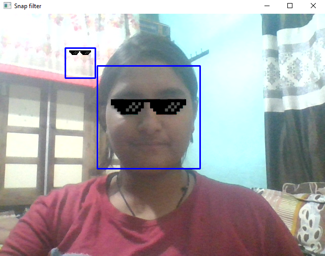
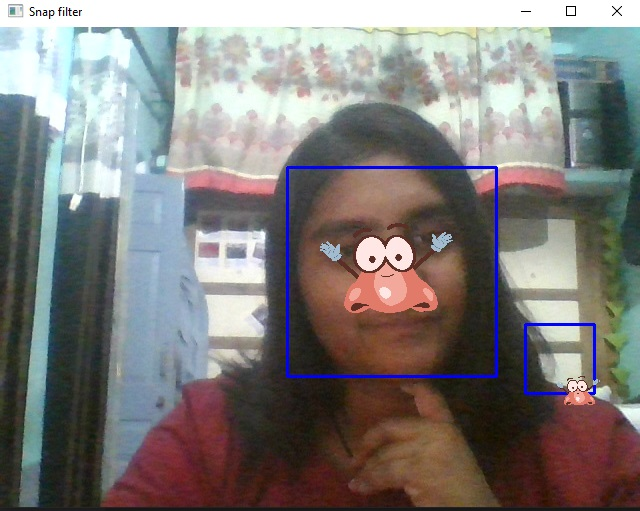

# Fun face filters with Python Opencv

This project is about **Face Detection** uses Haar Cascade Classifiers, Dlib Face Landmark Detection and the Mediapipe fetures to detect mainly faces positions ,eye position, nose positions, face and hand landmark detection. It uses this information to overlay different accessories to the faces.

## How does it work?

 ### Libraries Required:
     - opencv-python
     - cmake
     - dlib
     or 
     * pip install -r requirements.txt

  1. **Dlib**
     - Python offers a library called dlib, to find any facial landmarks. To detect a face, one first has to extract the face from the image and then use that extracted ROI (region of interest) of the face to get the landmarks. Dlib also provides a face detecting function called get_frontal_face_detector(). This function returns an array of arrays of rectangle objects. A rectangle object represents a rectangular area of an image. The dlib library provides a function named shape_predictor() that takes two parameters, the first being the grayscaled version of the image and the second is a dlib rectangle object that holds the coordinates of the face area. 

        **Dlib face landmark detection dataset**
        - shape_predictor_68_face_landmarks.dat

        **Results**
        - sunglasses_dlib.py

        
        

        - pig_nose_filter_dlib.py
        
        

    
    2. **HaarCascade Classifier**
     - The most famous process of face detection is using a haar cascade classifier which, returns a multidimensional numpy array. The number of elements in that array is equal to the number of faces present in the image. Each element of this array contains 4 integers. The first two indicating the top-left corner followed by the width and height of the ROI. The haar cascade classifier takes two more parameters, scaleFactor and minNeighbors. The scaleFactor parameter specifies how much the image size is reduced at each image scale and the minNeighbors parameter specifies how many neighbors each candidate rectangle should have to retain it. Basically, with these two parameters, you can control how strictly or loosely you want to detect faces in the image. The haar cascade extracts more area than the dlib function.
       
        **HaarCascade applied**
        1. haarcascade_frontalface_default.xml
        2. haarcascade_mcs_nose.xml
        3. haarcascade_eye_tree_eyeglasses.xml
        4. haarcascade_smile.xml
        5. haarcascade_eye.xml

        **Filters**
        1. Swag Glasses
            python snap_filters/sunglasseshaar.py
            image used : images/swag.png

            ### Result

            
        
        2. Pig Nose
            python snap_filters/pig_nose_filter_haar.py
            image used: images/pig_nose.png

            ### Result

            
            
        3. Nose Filter
            python snap_filters/nose_filter_haar.py
            image used: images/nose.png

            ### Result
            

        4. Capture Image With Smile
            python snap_filters/smile_selfie_cap.py
            Images stored in Selfie_Cap

**Virtual mouse**
 you'll get a mouse cursor that can move around, perform clicks and left / right / up / down swipes from your finger itself
 to run code:
 python vmouse.py

**Pressing keyboard keys using some object in webCam**
to run code: 
python useobject.py

**Difference b/w Haar Casacade Classifier and Dlib LIbrary**
   difference.txt

**To import file and run this code all the required modules are in requirement.txt**
    pip install -r requirements.txt
    

